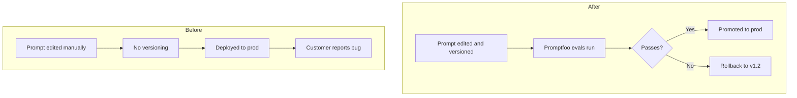

# PromptOps Lifecycle Governance

The installable governance artifact for safe, auditable, cost-aware LLM pipelines.

**Status:** v0.1.0 · Docs in progress · MIT licensed

Governance scaffolding for prompt versioning, eval gating, rollback flows, and observability — built for SaaS SDK teams deploying AI-native systems.

## Why This Exists

LLM-powered products are fragile.

Prompt drift, eval regressions, agent failures, hallucinations, cost spikes — these are real problems.

This repo installs a governance scaffold into your AI pipeline to help you:

- Version prompts like code
- Gate changes through CI evals
- Log every decision for auditability
- Mitigate multi-agent and RAG failures
- Align with OWASP and OpenTelemetry standards

Think of it as **“Terraform for Prompts”** — declarative, reproducible, and safe to scale.

## ❌ Before vs ✅ After Installing PromptOps Lifecycle Governance

<!-- Mermaid diagram: prompt governance lifecycle -->



| 🔴 Before                            | 🟢 After                                  |
| ------------------------------------ | ----------------------------------------- |
| Prompt edits are tribal knowledge    | All prompts versioned, logged, and diffed |
| No CI tests or rollback path         | Eval gates + one-command rollback         |
| Customers report failures            | Failures caught in staging, before prod   |
| Hallucinations, cost spikes, no logs | Eval diffs, cost checks, structured logs  |
| PMs guess what's safe to deploy      | Governance flows + promotion pipeline     |

## Who This Is For

This governance scaffold is designed for:

- **SaaS SDK PMs** — managing developer-facing LLM tools
- **Infra engineers** — building LangChain-style frameworks, agents, or eval layers
- **LLM platform teams** — integrating prompt pipelines into real workflows
- **AI governance teams** — enforcing prompt safety, reproducibility, and audit trails

## How This Helps in Practice

| Scenario                                   | Without PromptOps                                                                                                                            | With PromptOps                                                                                                                                         |
| ------------------------------------------ | -------------------------------------------------------------------------------------------------------------------------------------------- | ------------------------------------------------------------------------------------------------------------------------------------------------------ |
| **Agent breaks after a prompt tweak**      | A teammate tweaks the prompt to “sound more confident.” Suddenly the agent hallucinates APIs — and there’s no audit trail to debug.          | Every prompt change is versioned. Evals run automatically. If the change fails, rollback restores the last known-good version.                         |
| **PM requests a tone update**              | A PM asks, “Can we make the assistant friendlier?” The prompt is edited live. There’s no test coverage, and subtle regressions go unnoticed. | Prompt card is updated with metadata tags. Style-only changes are eval-tested for regressions before promotion. Logs track intent, change, and result. |
| **Cost spikes from new RAG flow**          | A new endpoint with retrieval-augmented generation increases token usage 3x. You only notice after seeing a surprise cloud bill.             | PromptOps logs token usage per prompt version. Cost spikes are flagged during CI before prod, with rollback paths if budget thresholds are exceeded.   |
| **Invisible prompt drift in SDK**          | Developers using your SDK report inconsistent completions. But there’s no diff in the codebase, and the prompt changes weren’t tracked.      | PromptOps tracks prompt diffs across versions. Eval configs surface behavior drift. Past working versions can be restored in one command.              |
| **Enterprise buyer asks about governance** | You scramble to answer questions about prompt safety, testing, or auditability. No formal policy, no reproducible process.                   | You share this repo: prompt versioning, CI evals, rollback flows, logs, and OWASP compliance — all demonstrable in one place.                          |

## What’s Inside

| Layer                 | Description                                                      |
| --------------------- | ---------------------------------------------------------------- |
| `schemas/`            | Prompt version schema, changelogs, canonical metadata            |
| `evals/`              | Promptfoo configs, test cases (core, variants, RAG, comparison)  |
| `logs/`               | Structured logging, cost metrics schema, observability formats   |
| `ci/`                 | Eval gates, production enforcement rules                         |
| `workflows/`          | Promotion pipelines, rollback flow, HITL approval templates      |
| `examples/`           | OWASP mapping, agent verification chains, lifecycle walkthroughs |
| `integration-guides/` | LangChain, OpenAPI, Pinecone integration patterns                |
| `audit/`              | Failure mode catalog, compliance mapping, audit trail templates  |
| `scripts/`            | CLI runners, prompt card dashboard generators                    |
| `tests/`              | Regression scenarios for various prompt behaviors                |
| `docs/`               | Full walkthroughs and role-specific documentation                |

## Quickstart

```bash
git clone https://github.com/yourname/promptops-lifecycle-governance.git
cd promptops-lifecycle-governance
python3 -m venv venv && source venv/bin/activate
pip install -r requirements.txt

make test  # Run governance eval with CI thresholds
```

Or run standalone:

```bash
python scripts/prompt-eval-runner.py         # Preview mode
python scripts/prompt-eval-runner.py --strict  # Enforces CI thresholds and blocks failing prompts

```

## Walkthroughs & Docs

- [What Is PromptOps?](docs/getting-started/what-is-promptops.md)
- [PromptOps FAQ](docs/getting-started/faqs.md)
- [Developer Integration Guide](docs/implementation/dev-guide.md)
- [Agent Governance Guide](docs/governance/agent-governance.md)
- [Full Docs Index →](docs/index.md)

---

## Key Make Commands

**Eval & Test**

- `make eval` — Run prompt evals
- `make test` — Run governance evals + CI checks
- `make inject-test`, `make rag-eval` — Run edge-case eval suites

**Dashboards & Logs**

- `make dashboard` — Generate PM-friendly dashboard YAML
- `make logs` — View sample output logs

**Tooling**

- `make format`, `make lint` — Optional formatting/linting

## License & Remixing

This repo is built for reuse.

You are encouraged to:

- Integrate this scaffold into SDKs, infra stacks, or platform tools
- Fork, remix, and extend evals, changelogs, CI gates, and audit tools
- Use this as a governance baseline for internal or regulated deployments

This project is licensed under the [MIT License](./LICENSE.txt). For dedicated support, enterprise integrations, or commercial licensing options, please contact us.

Contact: [kappainnovationllc@gmail.com](mailto:kappainnovationllc@gmail.com)

## Author

Built by [Hou Chia](https://linkedin.com/in/houchia) — a solo engineer designing governance scaffolds for AI-native teams.

See ongoing builds: [prompt-deploy.beehiiv.com](https://prompt-deploy.beehiiv.com)

## Inspirations

This artifact draws on patterns from:

- **Promptfoo** – for prompt evaluation pipelines
- **OpenTelemetry** – for traceable logs and cost observability
- **Terraform** – for declarative, auditable workflows
- **OWASP LLM Top 10** – for safety and risk mitigation

---

## Compliance & Extensibility

- Compliant with OWASP LLM Top 10
- Supports Promptfoo, LangChain, Pinecone, OpenAPI pipelines
- Extendable to Claude, GPT, and open-source models

For governance-grade prompt infrastructure — this is your installable starting point.
