# Agent Orchestration Guide

This document outlines governance and reproducibility strategies for orchestrating multi-agent LLM systems using PromptOps best practices.

Designed for teams deploying verifier/planner/actor chains with tools like LangGraph, ReAct, or OpenAPI agents.

---

## Why Agent Orchestration Needs Governance

- **Multiple agents share context** → need shared state versioning
- **Agents may loop, stall, or drift** → need trace logs + rollback flows
- **Verifier/planner/actor roles diverge** → need prompt alignment and evaluation

---

## Common Agent Roles

| Role     | Description                                             | Example Prompt Card               |
| -------- | ------------------------------------------------------- | --------------------------------- |
| Planner  | Breaks down goal into substeps                          | `prompt-card: task-planner-v1`    |
| Verifier | Evaluates if response meets task or safety goals        | `prompt-card: safety-verifier-v1` |
| Executor | Executes concrete action (e.g. call API, generate code) | `prompt-card: executor-v1`        |

---

## Governance Architecture

1. **Prompt Versioning per Agent**

   - Each agent prompt tracked in `schemas/prompt-version-schema.yml`
   - Shared state defined in `schemas/prompt-log-schema.json`

2. **Eval Layer per Agent**

   - Verifier → safety, hallucination, tone
   - Planner → plan coherence
   - Executor → correctness, cost

3. **Traceable Runs**

   - Use `trace_id`, `agent_role`, `version_hash` in logs
   - Sample run in `logs/log-sample.output.json`

4. **Failure Handling**
   - Infinite loop? → trigger `rollback-flow.md`
   - Verifier rejection? → block promotion, alert

---

## Example Agent Flow

```mermaid
flowchart TD
  Goal[User Goal] --> Plan[Planner Agent]
  Plan --> Exec[Executor Agent]
  Exec --> Verifier[Verifier Agent]
  Verifier -->|OK| Done[✅ Task Complete]
  Verifier -->|Reject| Rollback[🔁 Trigger Rollback]
```

