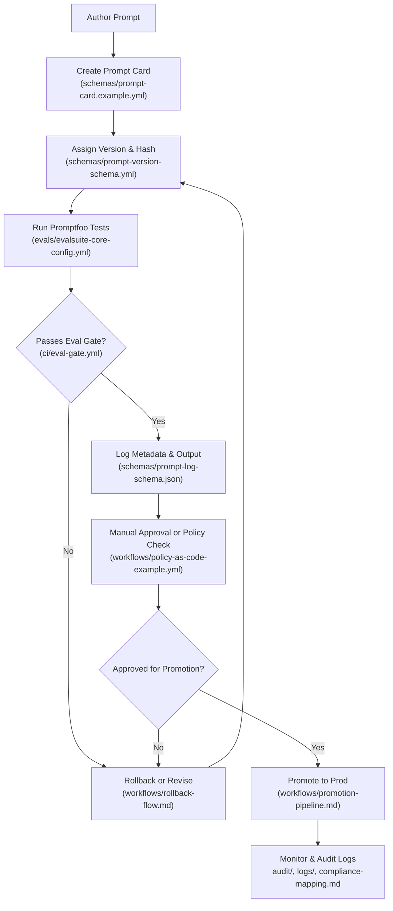

# Prompt Lifecycle Diagram

This diagram illustrates the governance flow of a prompt artifact inside a SaaS SDK environment, from creation to deployment and rollback.

## 🔍 Lifecycle Stage Descriptions

| Stage                           | Description                                                                                                                    | Artifact Reference                         |
| ------------------------------- | ------------------------------------------------------------------------------------------------------------------------------ | ------------------------------------------ |
| Author Prompt                   | Developer authors a new system prompt or RAG chain.                                                                            | N/A                                        |
| Create Prompt Card              | Create a governance wrapper with metadata and tags.                                                                            | `schemas/prompt-card.example.yml`          |
| Assign Version & Hash           | Apply semantic versioning and hash to freeze prompt.                                                                           | `schemas/prompt-version-schema.yml`        |
| Run Promptfoo Tests             | Evaluate against regression, hallucination, cost, etc.                                                                         | `evals/evalsuite-core-config.yml`          |
| Passes Eval Gate?               | CI pipeline blocks unsafe prompts.                                                                                             | `ci/eval-gate.yml`                         |
| Log Metadata & Output           | Log step trace, model name, prompt inputs/outputs, token usage, retrieved documents, and cost metrics using structured schema. | `schemas/prompt-log-schema.json`           |
| Manual Approval or Policy Check | Optional human-in-the-loop (HITL) approval or automated policy enforcement.                                                    | `workflows/policy-as-code-example.yml`     |
| Approved for Promotion?         | Conditional promotion gate to prod.                                                                                            | Manual or automated                        |
| Promote to Prod                 | Tag prompt version in registry, update CI/CD downstreams, notify SDK consumers or internal teams.                              | `workflows/promotion-pipeline.md`          |
| Monitor & Audit Logs            | Ongoing runtime monitoring and governance review.                                                                              | `audit/`, `logs/`, `compliance-mapping.md` |

---

## Summary

This lifecycle enables traceable, testable, and version-controlled prompt deployment inside any SaaS SDK pipeline. It serves as the backbone for PromptOps governance, enabling automated rollback, audit-grade logging, safety gating, and multi-agent reproducibility. Designed for integration into LangChain-class frameworks, Claude/GPT platforms, and enterprise RAG stacks.
